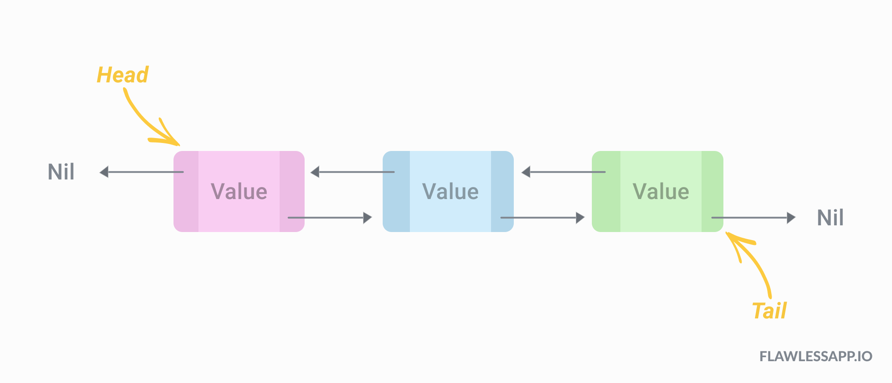

# Listas Encadeadas

## I - Lista Simplesmente Encadeada Ordenada:

  Contém as operações básicas de:
  
    1) Inserir uma nova chave na lista;
    2) Buscar uma chave na lista;
    3) Remover uma chave da lista;
    4) Remover todos as chaves em um certo intervalo de valores;
    5) Listar todas as chaves da lista;
    6) Listar as chaves dentro de um certo intervalo de valores;
    7) Listar as chaves de posição par ou impar da lista (seleção feita por parametro passado a função);
    8) Destruir a lista (que implica na destruição de todos os nós da lista).
  
## I(a) - Variante da Lista Simplesmente Encadeada Ordenada:

  A Lista inclui um ponteiro para o ultimo nó da lista, como na Figura 1. 

  Avalie as mudanças que devem ocorrer em cada uma das operações, caso essa informação esteja disponível.
    
## II - Lista Duplamente Encadeada:

  Considere agora uma mudança na estrutura da classe *nó*: incluir um segundo encadeamento que permita encontrar o predecessor do nó, como mostra a Figura 2.

  Implemente essa nova classe, com a mesmas operações definidas no item I.

  Avalie como a introdução desse segundo encadeamento tornam as operações na lista mais simples ou mais complexas. 
  
## III - Lista Duplamente Encadeada Circular:

Uma lista circular se caracteriza pelo ultimo nó da lista apontar não mais para um endereço `NULL` mas sim para o primeiro elemento, fechando um ciclo, como mostra a Figura 3.

  
## Referências Bibliográficas:

T.H.Cormen, C.E.Leiserson, R.L.Rivest, C.Stein. **Algoritmos – Teoria e Prática**. Editora Campus. 3a Edição, 2012.

A.M.Tenenbaum, Y.Langsam, M.J.Augenstein. **Estruturas de Dados usando C**. Makron Books. 1995.
